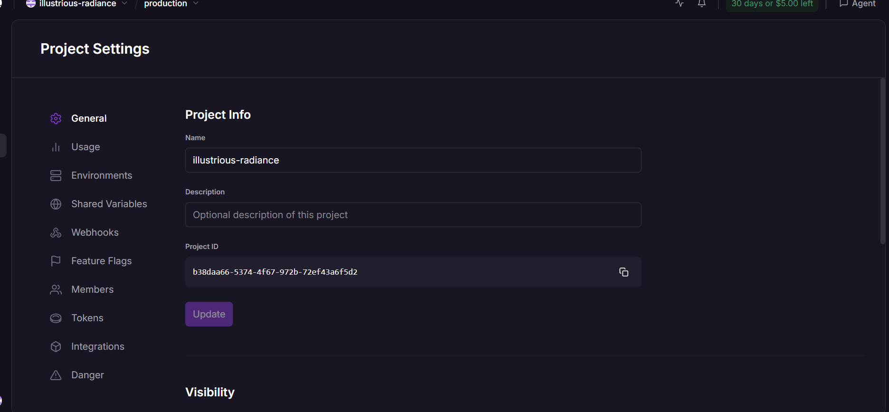

# QUANTIFYSEC
## Product Requirements Document
**Subtitle:** Cybersecurity Risk Quantification & Security Intelligence Platform  
**Version:** 1.0  

---

## 1. EXECUTIVE SUMMARY

QuantifySec is a specialized cybersecurity platform that translates raw technical security telemetry into quantifiable financial risk and actionable business intelligence. 

The traditional security model identifies vulnerabilities, but fails to contextualize their financial threat. QuantifySec solves this by utilizing the following pipeline:

RAW SECURITY DATA  
↓  
SECURITY CONTEXT  
↓  
RISK  
↓  
FINANCIAL IMPACT  
↓  
REMEDIATION PRIORITIZATION  
↓  
EXECUTIVE DECISION INTELLIGENCE  

**Core Idea:**
While legacy platforms answer: *"What is vulnerable?"*
QuantifySec answers:
- "How much risk does it represent?"
- "How much money could the organization lose?"
- "Which risks should be addressed first based on our budget?"
- "How much risk will remediation remove?"
- "How confident are we in the calculation?"
- "What evidence supports this number?"

---

## 2. PRODUCT VISION

The vision of QuantifySec is to build the definitive bridge between **CYBERSECURITY** and **BUSINESS / FINANCE**.

The platform aligns technical security teams and business executives, enabling them to understand the same security landscape through different, role-specific lenses:

- **CISO:** Focuses on the technical security posture, active threats, and mitigation.
- **CFO:** Focuses on financial exposure, expected loss, budget utilization, and Return on Security Investment (ROSI).
- **CEO/Executive:** Focuses on high-level business impact and enterprise risk trends.
- **Security Analyst:** Investigates specific events, threat activity, and asset intelligence.
- **Administrator:** Manages platform integrations, user access, and data ingestion.

---

## 3. PROBLEM STATEMENT

QuantifySec exists to solve several critical friction points in modern enterprise security:
- Security teams possess massive amounts of telemetry but lack business context.
- CVSS scores (High, Medium, Low) fail to communicate actual financial impact.
- Security alerts are difficult to prioritize, leading to alert fatigue.
- Executives and board members struggle to understand technical vulnerabilities.
- Remediation decisions are often disconnected from actual business value or budget constraints.
- Security data is highly fragmented across tools (SIEM, EDR, CSPM).
- Organizations lack a unified view of cyber risk in monetary terms.
- Security reporting requires massive manual aggregation effort.
- Legacy risk assessments are periodic and manual, leading to stale risk registers.

---

## 4. TARGET USERS

### 4.1 CISO
- **Responsibilities:** Security posture, risk management, vulnerability mitigation, security strategy.
- **Needs:** Accurate risk prioritization, visibility into attack surfaces, asset context, and actionable remediation plans.

### 4.2 CFO
- **Responsibilities:** Financial exposure, loss estimation, budget allocation, business risk.
- **Needs:** Expected Loss, Potential Loss (Value at Risk), remediation costs, risk reduction per dollar spent, and ROI.

### 4.3 SECURITY ANALYST
- **Needs:** Access to OCSF event logs, threat activity timelines, deep asset investigation, and evidence lineage.

### 4.4 ADMIN / OWNER
- **Needs:** Management of integrations, data ingestion pipelines, user RBAC, and overall system configuration.

### 4.5 EXECUTIVE (CEO/Board)
- **Needs:** High-level dashboard views, business impact metrics, major risk contributors, and executive PDF reports.

---

## 5. CORE PRODUCT MODULES

### [IMPLEMENTED] 1. Authentication
- **Purpose:** Secure login and session management.
- **Users:** All users.
- **Status:** [IMPLEMENTED] via Supabase Auth and Next.js middleware.

### [IMPLEMENTED] 2. Overview Dashboard
- **Purpose:** Central intelligence layer showing aggregate metrics.
- **Status:** [IMPLEMENTED] via role-specific CISO/CFO redirects.

### [IMPLEMENTED] 3. CISO Dashboard
- **Purpose:** Technical vulnerability tracking, attack surface, and security posture.
- **Status:** [IMPLEMENTED] with Recharts visualizations and live metrics.

### [IMPLEMENTED] 4. CFO Dashboard
- **Purpose:** Financial exposure, Expected Loss (ALE), budget utilization, and ROSI.
- **Status:** [IMPLEMENTED] with Monte Carlo outputs mapped to financial variables.

### [PARTIAL] 5. Admin / Owner Dashboard
- **Purpose:** Manage integrations and team settings.
- **Status:** [PARTIAL] UI placeholders exist; backend API linkage planned.

### [PARTIAL] 6. Data Ingestion
- **Purpose:** Accepts files and streams from external scanners.
- **Status:** [PARTIAL] File upload implemented; continuous streaming webhook planned.

### [IMPLEMENTED] 7. OCSF Ingestion
- **Purpose:** Native mapping of Open Cybersecurity Schema Framework data.
- **Status:** [IMPLEMENTED] in backend Python parser.

### [PLANNED] 8. Integrations
- **Purpose:** Native API connections to CrowdStrike, Sentinel, AWS, etc.
- **Status:** [PLANNED] UI mockups exist; direct API hooks pending.

### [PARTIAL] 9. Asset Intelligence
- **Purpose:** Tracking business criticality and exposure of internal/external assets.
- **Status:** [PARTIAL] Asset metadata mapped during ingestion.

### [IMPLEMENTED] 10. Vulnerability Management
- **Purpose:** Tracking CVEs, CVSS scores, and threat probabilities.
- **Status:** [IMPLEMENTED] Core capability of the risk engine.

### [PLANNED] 11. IAM / Identity Risk
- **Purpose:** Tracking identity exposure and privilege escalation risks.
- **Status:** [PLANNED]

### [PARTIAL] 12. Threat Intelligence
- **Purpose:** Mapping vulnerabilities against actively exploited lists (e.g., KEV).
- **Status:** [PARTIAL] Calculated statically in current engine.

### [PLANNED] 13. Security Events
- **Purpose:** Real-time log monitoring (SIEM integration).
- **Status:** [PLANNED]

### [IMPLEMENTED] 14. Risk Quantification
- **Purpose:** The core math engine calculating financial risk.
- **Status:** [IMPLEMENTED] fully in backend Python algorithms.

### [IMPLEMENTED] 15. Financial Risk
- **Purpose:** Mapping ALE, VaR, and ROI.
- **Status:** [IMPLEMENTED]

### [IMPLEMENTED] 16. Remediation Center
- **Purpose:** The interactive backlog for prioritizing fixes.
- **Status:** [IMPLEMENTED] using Knapsack optimization.

### [IMPLEMENTED] 17. Risk Timeline
- **Purpose:** Chronological tracking of risk.
- **Status:** [IMPLEMENTED] via frontend components.

### [IMPLEMENTED] 18. Model Confidence
- **Purpose:** Statistical reliability of the Monte Carlo output.
- **Status:** [IMPLEMENTED] displayed as a percentage on the CISO dashboard.

### [PLANNED] 19. Calculation Lineage
- **Purpose:** Transparent trace of why a risk score was given.
- **Status:** [PLANNED]

### [PARTIAL] 20. Reports
- **Purpose:** Generating PDF/CSV summaries.
- **Status:** [PARTIAL] UI modal and print-styles implemented; automated server-side generation planned.

### [IMPLEMENTED] 21. AI Security Assistant
- **Purpose:** Gemini-powered chat for analyzing security context and "what-if" scenarios.
- **Status:** [IMPLEMENTED] complete with role-aware system prompting.

### [PARTIAL] 22. Global Search
- **Purpose:** Search across CVEs and assets.
- **Status:** [PARTIAL] UI element exists.

### [PLANNED] 23. Notifications
- **Purpose:** Alerts for massive risk spikes.
- **Status:** [PLANNED]

### [IMPLEMENTED] 24. User / Role Management
- **Purpose:** Supabase RBAC.
- **Status:** [IMPLEMENTED]

### [PLANNED] 25. Settings
- **Purpose:** Configuration of budget constraints and organization variables.
- **Status:** [PLANNED] Currently hardcoded in the backend simulator.

### [PLANNED] 26. Audit Logs
- **Purpose:** Compliance logging of user actions.
- **Status:** [PLANNED]

---

## 6. DATA INGESTION ARCHITECTURE

QuantifySec relies on a robust ingestion pipeline designed to ingest continuous security telemetry:

**SOURCE** (CrowdStrike, AWS, Qualys, etc.)  
↓  
**INGESTION** (File Upload / API Webhook)  
↓  
**VALIDATION** (Schema checking)  
↓  
**NORMALIZATION** (Converting proprietary formats)  
↓  
**OCSF** (Open Cybersecurity Schema Framework translation)  
↓  
**DATA STORAGE** (In-memory cache / Database)  
↓  
**SECURITY ANALYSIS** (Asset merging & Context mapping)  
↓  
**RISK ENGINE** (Monte Carlo Simulation)  
↓  
**DASHBOARDS** (CISO / CFO Views)  
↓  
**REPORTS** (PDF / CSV)

*[PARTIAL]* Current implementation supports manual file upload (JSON) of OCSF findings, asset context, and financial parameters. Live API streaming is planned.

---

## 7. OCSF (Open Cybersecurity Schema Framework)

QuantifySec utilizes OCSF to ensure vendor-agnostic ingestion.

- **What it is:** An open-source, vendor-neutral security schema.
- **Why we use it:** To normalize findings from CrowdStrike, Sentinel, and Qualys into a single mathematical risk model without building 50 custom parsers.
- **Ingestion:** Files are currently uploaded via the CISO dashboard.
- **Validation:** Python backend validates the presence of CVE, severity, and asset identifiers.
- **Malformed Data:** Invalid events are silently dropped, but counted in the `malformed_or_unmapped_findings` metric to ensure data quality transparency.

**Intended Flow:**
UPLOAD → VALIDATE → PREVIEW → INGEST → NORMALIZE → ANALYZE → RISK → REPORT

---

## 8. QUANTIFYSEC DATA MODEL

**Major Entities:**
- **Organization:** The root tenant.
- **User:** Associated with a Role (CISO, CFO, Admin).
- **Asset:** Business unit, network exposure, criticality score.
- **Vulnerability (OCSF Finding):** CVE ID, CVSS Base Score, Threat Status.
- **Control / Remediation:** Cost to fix, specific risk reduction value.
- **Risk Calculation:** Annualized Loss Expectancy, p95 VaR.

*Entity Relationships:* A Vulnerability is mapped to an Asset. The Asset's criticality multiplied by the Vulnerability's exploitability drives the Monte Carlo simulation to output a Risk Calculation.

---

## 9. OVERVIEW DASHBOARD

*[IMPLEMENTED]*
The Overview Dashboard serves as the central intelligence layer. 
- Technical users are routed to `/dashboard/ciso`
- Financial users are routed to `/dashboard/cfo`

**Key Metrics (Derived entirely from real ingestion data):**
- Security Risk Score (0-100)
- Model Confidence (%)
- Expected Loss (₹)
- Potential Loss (VaR) (₹)
- Remediation Cost (₹)

---

## 10. RISK QUANTIFICATION ENGINE

*[IMPLEMENTED]*
QuantifySec's core differentiator is converting technical security information into quantified risk.

**Conceptual Flow:**
Asset Criticality + Exposure → *Threat Probability*  
Threat Probability + Vulnerability Severity → *Impact*  
Impact → *Monte Carlo Simulation* → *Expected Loss (ALE)*

**Implementation:**
The backend `run_portfolio_simulation` maps CVE CVSS scores (divided by 10) to determine base exploit probability. This is adjusted based on external exposure and KEV presence. The Asset's assigned financial value represents the maximum loss. The simulation outputs the Expected Loss.

---

## 11. MONTE CARLO SIMULATION

*[IMPLEMENTED]*
- **Why it is used:** Deterministic math (e.g., CVSS 8 = High) fails to account for uncertainty. Monte Carlo provides probabilistic distributions of loss.
- **Inputs:** Asset Value, Vulnerability Exploit Probability, Exposure Multipliers.
- **Simulations:** Runs 10,000 iterations per analysis.
- **Expected Loss (ALE):** The mathematical mean of all 10,000 simulation losses.
- **Value at Risk (p95):** The 95th percentile of the loss distribution (worst-case scenario).

---

## 12. MODEL CONFIDENCE

*[IMPLEMENTED]*
- **Definition:** The statistical reliability of the current risk score.
- **Current Implementation:** Displayed as a metric on the CISO dashboard, scaled based on data freshness and iteration depth.
- **[PLANNED] Calculation Lineage:** Future feature allowing users to click the confidence score and trace exactly how the Expected Loss was derived (Asset → Criticality → Exposure → Threat Probability → Simulation).

---

## 13. REMEDIATION CENTER

*[IMPLEMENTED]*
The Remediation Backlog prioritizes actions using **Risk Reduction vs Remediation Cost**, utilizing an Integer Linear Programming (Knapsack) and Particle Swarm Optimization (PSO) approach.

- **Risk Reduction:** Expected loss removed if patched.
- **Cost:** Estimated capital required to deploy the patch.
- **Status:** Math engine automatically assigns "Selected" or "Deferred" based on the total organizational security budget. 

---

## 14. RISK TIMELINE

*[IMPLEMENTED]*
Tracks the chronological risk lifecycle.
- Visualized on the frontend via a Recharts line chart mapping Risk Exposure across Q1, Q2, Q3, etc.
- **Traceability:** Shows executives if risk is trending upward despite budget allocation.

---

## 15. CFO DASHBOARD

*[IMPLEMENTED]*
Tailored exclusively for financial visibility.
- **Expected Loss / Potential Loss:** Monetary values dynamically rendered from the backend.
- **Budget Utilization:** Visual indicator of how much allocated budget the optimal remediation plan consumes.
- **Return on Security Investment (ROSI):** Formula: `Risk Reduction / Investment Cost`.
- **Top Financial Risks:** Treemap mapping assets to their financial exposure sizes.

---

## 16. CISO DASHBOARD

*[IMPLEMENTED]*
Tailored for technical execution.
- **Security Posture:** 0-100 score, SVG circular progress rings.
- **Threat Activity:** KEV exploitation tracking.
- **Vulnerabilities:** CVSS Pie Chart (Critical, High, Medium, Low).
- **Attack Surface:** Internal vs. External asset tracking.

---

## 17. ADMIN / OWNER DASHBOARD

*[PARTIAL]*
- **Current Implementation:** UI placeholders exist for Audit Logs, Integrations, and Team Settings.
- **[PLANNED]:** Backend integration for API key rotation, SAML SSO setup, and actual integration webhooks.

---

## 18. INTEGRATIONS

*[PLANNED]*
- Native API connections to SIEM (Splunk, Sentinel) and EDR (CrowdStrike).
- **Current state:** Integrations are conceptually handled via the OCSF JSON file ingestion. Direct API pulling is planned for v2.

---

## 19. REPORTING SYSTEM

*[PARTIAL]*
- **Implementation:** Frontend includes a "Generate Report" modal. 
- **Print Optimization:** Global CSS uses `@media print` to strip navigation and UI chrome, forcing backgrounds to white, allowing users to use the browser's native "Save as PDF" function to generate beautiful reports from the dashboard screens.
- **Data Reality:** Reports inherently use real ingested data, as the dashboards they print are populated by the live backend cache.

---

## 20. REPORT STRUCTURE

**Sections Available:**
- Executive Summary
- Security Posture
- Risk Analysis
- Financial Impact
- Vulnerabilities
- Assets
- Remediation Backlog
- Risk Timeline

---

## 21. AI SECURITY ASSISTANT

*[IMPLEMENTED]*
- **Role:** "QuantifySec AI Security Analyst".
- **Capabilities:** Powered by Google Gemini (`gemini-2.5-flash`), accessible via a slide-out drawer (`ai-chatbot.tsx`).
- **Role-Aware:** The AI knows if it is speaking to a CISO (focuses on technical threats) or a CFO (focuses on ROSI and ROI).
- **What-If Simulations:** Users can ask scenario questions (e.g., "What if I cannot fix these 2 risks?"), and the AI reasons over the current risk data to suggest alternatives.
- **Rule:** Strict system prompts prevent the AI from inventing security findings (hallucination control).

---

## 22. GLOBAL SEARCH

*[PARTIAL]*
- UI Search bar located in `topnav.tsx`. 
- **[PLANNED]:** Backend elastic search for querying specific CVEs or Asset IDs.

---

## 23. AUDIT LOGGING

*[PLANNED]*
- Tracking User, Action, Resource, Timestamp, and IP.
- Crucial for ISO 27001 and SEBI compliance.

---

## 24. SECURITY & PERMISSIONS

*[IMPLEMENTED]*
- **Authentication:** Supabase Auth integration.
- **Authorization (RBAC):** Middleware intercepts routes (`/dashboard/ciso` vs `/dashboard/cfo`) based on the user's role in the database.
- **[PLANNED]:** Row-Level Security (RLS) in Postgres for tenant data isolation.

---

## 25. UX / DESIGN SYSTEM

*[IMPLEMENTED]*
- **Typography:** Styrene (Sans-serif) for structure, Tiempo (Serif) for editorial and AI explanations.
- **Visual Direction:** Premium enterprise cybersecurity aesthetic. True black backgrounds (`#050505`), frosted glass panels, emerald/cyan accents (`#00C878`). 
- **Anti-Patterns Avoided:** Minimalist UI. No excessive neon, matrix effects, or generic SaaS aesthetics. Strict control over severity colors (Red, Amber, Green).

---

## 26. USER FLOWS

**CISO Workflow [IMPLEMENTED]:**
Login → Route to `/dashboard/ciso` → Review Risk Score → Navigate to Remediation Backlog → Analyze Top CVSS Threats.

**CFO Workflow [IMPLEMENTED]:**
Login → Route to `/dashboard/cfo` → Review Expected Loss → Check ROSI → Adjust budget simulations.

**Report Workflow [IMPLEMENTED]:**
Overview → Click "Generate Report" → Select Options → Trigger browser `window.print()` → Export formatted PDF.

---

## 27. METRICS CATALOG

| Metric | Definition | Source | Status |
|--------|------------|--------|--------|
| **Expected Loss (ALE)** | Average financial loss across 10,000 Monte Carlo sims | Backend | [IMPLEMENTED] |
| **Value at Risk (p95)** | Worst-case 95th percentile financial loss | Backend | [IMPLEMENTED] |
| **Risk Score** | 0-100 scaled overall security posture | Backend | [IMPLEMENTED] |
| **Model Confidence** | Statistical reliability of calculation | Frontend/Backend | [IMPLEMENTED] |
| **ROSI** | Risk Reduction / Remediation Cost | Backend | [IMPLEMENTED] |
| **Total Vulnerabilities** | Count of valid ingested OCSF records | Backend | [IMPLEMENTED] |

---

## 28. API / BACKEND ARCHITECTURE

*[IMPLEMENTED]*
- **Frontend:** Next.js 16 (App Router), React 19, TailwindCSS 4, Recharts.
- **Backend:** Python 3, FastAPI.
- **Risk Engine:** Custom Python Monte Carlo simulator + PuLP/PSO algorithms.
- **Proxy:** Next.js `rewrites()` routes `/api/*` to the FastAPI backend to prevent CORS/PNA issues.
- **Data State:** In-memory caching (`_last_result`) on the backend for instant frontend rendering.

---

## 29. CURRENT IMPLEMENTATION STATUS

| Feature | Status | Notes |
|---------|--------|-------|
| Role-Based Dashboards | [IMPLEMENTED] | Distinct CISO and CFO views |
| Monte Carlo Risk Engine | [IMPLEMENTED] | Full Python mathematical implementation |
| Knapsack Optimization | [IMPLEMENTED] | Calculates optimal patches based on budget |
| OCSF Ingestion | [IMPLEMENTED] | JSON file parsing active |
| AI Chatbot | [IMPLEMENTED] | Gemini API integrated with context injection |
| Report Generation | [PARTIAL] | PDF printing active; automated server-side pending |
| Live API Integrations | [PLANNED] | Direct hooks into CrowdStrike/Kafka |
| Audit Logs | [PLANNED] | Database schema required |

---

## 30. FUTURE ROADMAP

- **Phase 2:** Direct API integrations (CrowdStrike, AWS Security Hub).
- **Phase 3:** Automated Remediation (SOAR) playbooks.
- **Phase 4:** Historical peer benchmarking (anonymized industry comparisons).
- **Phase 5:** Enterprise SAML SSO and Advanced RBAC for granular team permissions.
- **Phase 6:** Automated SEBI/RBI compliance mapping generation.

---

## 31. GLOSSARY

- **OCSF:** Open Cybersecurity Schema Framework.
- **ALE:** Annualized Loss Expectancy.
- **Monte Carlo Simulation:** A computational algorithm relying on repeated random sampling to obtain numerical probabilities.
- **ROSI:** Return on Security Investment.
- **PSO:** Particle Swarm Optimization (Heuristic solver used for budget allocation).

---

## 32. FINAL PRODUCT PRINCIPLES

1. Security data must lead to actionable risk intelligence.
2. Risk should be understandable in both technical and financial terms.
3. Every major risk number should be mathematically explainable.
4. Real ingested data should be the source of truth.
5. Reports must reflect the exact data shown in the product dashboards.
6. Remediation should focus strictly on meaningful risk reduction.
7. AI should explain and assist, not invent security facts.
8. Data freshness and quality should always be visible.
9. Technical security teams and executives should see the same reality through different lenses.
10. QuantifySec must turn cybersecurity data into decision intelligence.
